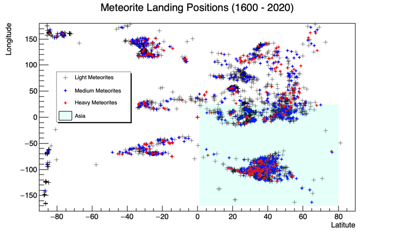

# AstroPlot

## Meteorite Landings

This section analyses public datasets for meteorite landing from NASA. Relevant ROOT macros can be found under `/MeteoriteLandingPlots` and results could be found under `/results`.

### Analysis of Meteorite Landing Frequency

.png)

.png)

### Analysis of Meteorite Landing Position

